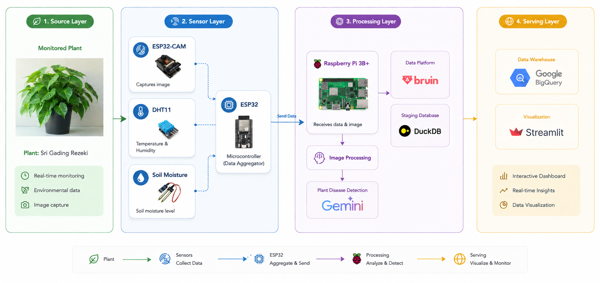

# Raspberry Pi Data Warehouse IoT Smart Monitoring

An IoT-based smart plant monitoring system that combines edge computing,
lightweight AI inference, distributed processing, and cloud analytics
using a Raspberry Pi edge node, a VPS, and BigQuery.

---

## Overview

Plant conditions are monitored in near real-time using IoT sensors and
image-based disease detection. The architecture is split across three
layers so that each device only does work that fits its resource budget:

- **ESP32 / ESP32-CAM** for data acquisition
- **Raspberry Pi 3B** as an edge computing node (TensorFlow Lite inference)
- **VPS** for the message broker, staging database, transformations, and ETL
- **BigQuery** as the analytical data warehouse
- **Streamlit** for the operator dashboard

---
                 
## System Architecture



### Source Layer (IoT Devices)

- ESP32-CAM (image capture)
- DHT11 temperature & humidity sensor
- Soil moisture sensor

Devices publish to the MQTT broker on the VPS.

### Edge Layer — Raspberry Pi 3B (1 GB RAM)

Lightweight workloads only:

- Receive sensor data from ESP32 devices
- Receive images from ESP32-CAM
- Image resize / compression and preprocessing
- TensorFlow Lite inference (plant disease prediction)
- Publish sensor readings and prediction results to MQTT

Bulk storage and heavy transformation are delegated to the VPS.

### VPS / Cloud Processing Layer (2 GB RAM)

- **Mosquitto** — MQTT broker for sensor and prediction topics
- **Ingestor** — subscribes to MQTT and writes raw events into DuckDB
- **DuckDB** — local staging / analytical database
- **Bruin** — pipeline that cleans, transforms, and aggregates the
  staged data into curated tables
- **ETL uploader** — incrementally loads curated tables from DuckDB
  into BigQuery
- **Streamlit dashboard** — operator-facing UI

### Cloud Analytics Layer

- **BigQuery** stores curated datasets and serves analytical queries
- **Streamlit** reads from BigQuery (and DuckDB for fast local views)

---

## Data Flow

```text
ESP32 / ESP32-CAM
        │
        ▼
Raspberry Pi 3B (edge inference, TFLite)
        │  MQTT
        ▼
VPS
 ├─ Mosquitto (broker)
 ├─ Ingestor  (MQTT → DuckDB)
 ├─ DuckDB    (staging)
 ├─ Bruin     (clean / transform / aggregate)
 └─ ETL       (DuckDB → BigQuery, incremental)
        │
        ▼
BigQuery  ──►  Streamlit Dashboard
```

---

## Services & Ports (docker-compose)

All services run on the `plant-net` bridge network. Only the broker and
dashboard publish ports to the host.

| Service     | Image                              | Host Port | Container Port | Role                                              |
|-------------|------------------------------------|-----------|----------------|---------------------------------------------------|
| `mosquitto` | `eclipse-mosquitto:2.0`            | 1883      | 1883           | MQTT broker                                       |
| `mosquitto` | `eclipse-mosquitto:2.0`            | 9001      | 9001           | MQTT over WebSockets                              |
| `ingestor`  | `python:3.11-slim` (paho-mqtt, duckdb) | —     | —              | Subscribes to MQTT, writes raw events to DuckDB   |
| `bruin`     | `ghcr.io/bruin-data/bruin:latest`  | —         | —              | One-shot pipeline run against `./bruin`           |
| `etl`       | `python:3.11-slim` (duckdb, google-cloud-bigquery, pandas, pyarrow) | — | — | Incremental DuckDB → BigQuery upload |
| `dashboard` | `python:3.11-slim` (streamlit, duckdb, pandas, google-cloud-bigquery, pyarrow) | 8501 | 8501 | Streamlit UI |

Shared volumes:

- `mosquitto-data`, `mosquitto-log` — broker persistence
- `duckdb-data` — DuckDB staging file shared between `ingestor`, `bruin`,
  `etl`, and `dashboard`
- `./secrets:/secrets:ro` — Google service account JSON for BigQuery

---

## Configuration

Copy the example env file and adjust as needed. Compose picks it up
automatically.

```bash
cp .env.example .env
```

| Variable        | Default              | Used by             |
|-----------------|----------------------|---------------------|
| `BQ_PROJECT_ID` | `your-gcp-project`   | `etl`, `dashboard`  |
| `BQ_DATASET`    | `smart_plant`        | `etl`, `dashboard`  |

Place your Google service account JSON at `./secrets/gcp-sa.json`. It is
mounted read-only into `etl` and `dashboard` and referenced by
`GOOGLE_APPLICATION_CREDENTIALS`.

MQTT topics consumed by the ingestor (override with `MQTT_TOPICS`):

```text
plants/<plant_id>/sensors
plants/<plant_id>/predictions
```

---

## Quick Start

```bash
# 1. Start the broker, ingestor, and dashboard
docker compose up -d mosquitto ingestor dashboard

# 2. Run the Bruin pipeline once curated data should be (re)built
docker compose run --rm bruin

# 3. Start the ETL uploader (needs ./secrets/gcp-sa.json)
docker compose up -d etl
```

Open the dashboard at <http://localhost:8501>. The MQTT broker is
reachable on `localhost:1883` (TCP) and `localhost:9001` (WebSockets).

> Note: `bruin` is a one-shot job. `etl` and `dashboard` only `depends_on`
> it for *startup* ordering, not completion. Re-run `docker compose run
> --rm bruin` whenever you want to refresh curated tables.

---

## Technology Stack

| Category          | Technology                       |
|-------------------|----------------------------------|
| IoT Device        | ESP32, ESP32-CAM                 |
| Sensors           | DHT11, Soil Moisture             |
| Edge Computing    | Raspberry Pi 3B                  |
| Messaging         | MQTT, Mosquitto                  |
| AI Inference      | TensorFlow Lite                  |
| Data Processing   | Bruin                            |
| Staging Database  | DuckDB                           |
| Data Warehouse    | Google BigQuery                  |
| Dashboard         | Streamlit                        |
| Orchestration     | Docker Compose                   |

---

## Resource Distribution

### Raspberry Pi 3B (1 GB RAM)

- Sensor reception
- Image preprocessing
- TensorFlow Lite inference
- MQTT publishing

### VPS (2 GB RAM)

- MQTT broker (Mosquitto)
- DuckDB staging
- Bruin transformations
- ETL upload to BigQuery
- Streamlit dashboard
